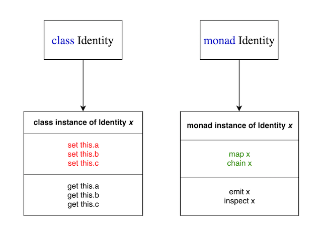

# Monads in Javascript

---

# What is "monad"

-   The most general definition: _a single unit_

--

-   Etymologically linked to: monad, dyad, triad

--

-   Used in mathematics as an important part of _category theory_

--

-   Adopted by _functional programming_, popularized by Haskell and then spread from there

--

-   Don't get too hung up on the name though; **naming is hard in computer sciences**

--

-   The broad definition (_"single unit"_) is actually more useful to have in mind when working with monads!

---

# What is a monad in Javascript?

-   Think of it as a "container" type... like `Array` and `Object`, with an API to generate new values and new monads

--

-   This keeps it in line with being a _single unit_

--

-   There are types of monads; while all monads adhere to the same rules, there are an infinite number of potential uses

--

-   Example immutable monad in JS: `Identity` monad

```js
const Identity = x => ({
    chain: f => f(x),
    emit: () => x,
    map: f => Identity(f(x))
});

const one = Identity(1);
```

---

# `Identity` monad example

```js
const Identity = x => ({
    chain: f => f(x),
    emit: () => x,
    map: f => Identity(f(x))
});

const one = Identity(1);
```

-   FP style convention: Capitalize the monad (it is class-like)

--

-   `Identity` is an example of a very basic monad, just returns a monad containing the value given

--

-   Historically, the term "identity" is used in programming to mean a function that returns whatever was passed to it

--

-   Assigning to a Constant Function Expression (CFE) ensures immutibility: argument `x` can never be altered in any circumstance

--

-   Returning an object implicitly from the function gives the monad its methods

---

# `Identity` monad example

```js
const Identity = x => ({
    chain: f => f(x),
    emit: () => x,
    map: f => Identity(f(x))
});

const one = Identity(1);
```

-   This returned object gives this pattern modularity: many more methods can be added

--

-   Not all (in fact, few) implementations of monads in JS have used this pattern

--

-   Implementations often uses classes (`function` prototypes or `class`) to do this, but I find CFEs to be 100% safe from mutation

---

# `Identity` monad example

-   Example API if one were to use a `class`:

```js
// some libraries return an instance of a class
// e.g. store the value in `this.__value`
const one = Identity(1);

// > 1
console.log(one.__value);

// but with that you can often mess with the instance
one.__value = 2;

// > 2
console.log(one.__value);
```

---

# `Identity` monad example

-   CFE Example:

```js
const Identity = (x) => ({
    chain: f => f(x),
    emit: () => x,
    map: f => Identity(f(x))
});

const one = Identity(1);

// There's just no way to access the value via accessors
console.log(one.??????)

// Can only get by .emit(), no way to set
// > 1
console.log(one.emit());

// ... except to create a whole new monad result
// > 2
console.log(one.map(a => a + 1).emit());
```

---



---

# `Identity` monad example

-   `map` and `chain` spawn new instances; unlike class' `set` which alters the existing instance

--

-   `emit` (aka `join`) and `inspect` are getters for contained values

--

```js
const Identity = x => ({
    chain: f => f(x),
    emit: () => x,
    map: f => Identity(f(x))
});

const one = Identity(1);
const two = Identity(1).map(a => a + 1);
```

--

-  `chain` is sometimes called `bind` or `flatMap`

---

# `Identity` monad example

-   Usually `.of()` is used as a constructor

```js
const one = Identity.of(1);
```

--

-   This gives you a hint that you're dealing with a monad

--

-   You'll see in a couple minutes how this is done

---

# Other monads

-   There's a lot of established terminology for monad patterns, the `Identity` monad is but one

--

-   Other examples: `IO`, `List`, `Future`, `Either` (`Left`, `Right`), `Maybe` (`Just`, `Nothing`)

--

-   Google any of these (e.g. "Just monad", "IO monad") and you'll find some Haskell documentation

--

-   Add to that Google search "js" and you'll get some examples in JS

--

-  ⚠️ Warning: they are often in `function` or `class` style, and/or do weird things with `Proxy` and generators

--

-   Can't find an established pattern? Design your own!

--

-   Let's take a look at some live code to see how this is done....

---

# Live Code!

---

# More monads

-   You can build your own as shown, or use a template

--

-   https://github.com/rgeraldporter/ts-monad-boilerplate as example (in Typescript though), includes Monad Laws in unit tests

--

-   ⚠️ Opinion: A good monad module is likely to have zero dependencies, unless hooking into a framework like Sanctuary

--

-   The frameworks' audiences tend to be those coming from a Functional Programming background trying to work in Javascript, rather than those who work in Javascript looking to explore Functional Programming

--

-   ⚠️ Opinion: FP projects in JS tend to use esoteric language, if you are frustrated at the documentation, you're not alone

---

# Monad benefits

-   In the longer term, you'll feel more confident in the stability of your code

--

-   Less "variables" means fewer things to keep your head at once

--

-   `const` isn't great for `Object` or `Array` as they are still internally mutable, monads can rein that in

--

-   Using monads can help create standard interfaces with all your data via `.map`, `.chain`

---

# Monad drawbacks

-   Debugging can be tougher, very similar to how `Promise` is debugged

--

-   There is still a "mental leap" to make for those seeing the code for the first time

--

-   The longer you've been doing Javascript, the more difficult it might be to grasp at first, many practies are counter to OOP thinking

---

# Recommended follow-up

- Copy the live code examples and play around!

- Professor Frisby (Mostly Adequate Guide, videos)

- Take a look at Ramda

- Also see: Sanctuary, Folktale